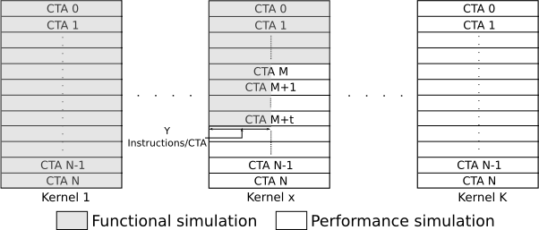

# checkpoint documentation #

The following diagram shows the how checkpoiting works and different variables which can be user defined

A program can be run in functional simulation mode upto some point and then GPU states are stored in files so that program can be resumed from same point in performance simulation mode

**Following details are stored in "checkpoint\_files" folder in you run area**

1. Global memory per kernel

2. Local memory per thread

3. Shared memory per CTA

4. Register file per thread

5. SIMT stack per warp

The varibales shown in the diagram can be set in gpgpusim.config file.

**Whether checkpoint should be executed or not**

-checkpoint\_option 0   

**At which kernel checkpoint should be executed .  (x from the figure)**

-checkpoint\_kernel 1

**How many CTA are executed 100% before checkpoint. (M from the figure)**

-checkpoint\_CTA 50

**Whether resume should be executed or not**

-resume\_option 0

**From which CTA to resume (M from the figure)**

-resume\_CTA 50

**From which kernel to resume (x from the figure)**

-resume\_kernel 1

**From M to t, CTA are executed partially (t from the figure)**

-checkpoint\_CTA\_t 100

**How many instruction are executed before checkpoint in partial CTA**

-checkpoint\_insn\_Y 104

**Suppose, each thread is executing 26 instructions and there are 256 threads in a block. You want to checkpoint after 13 instructions in each thread, then Y should be set to = 13\*256/warp\_size = 104, if 32 is the warp size**

For an example, in check samples/0\_Simple/vectorAdd folder

vectorAdd.cu launches 2 kernels with 256 CTA each and 256 threads per CTA and 26 instructions per thread.

Checkpoint in 1st kernel after 50 full CTA and and 50 partial CTA (13\*256 instructions per CTA)

Then following options should be added to gpgpusim.config

-gpgpu\_ptx\_sim\_mode 1

-checkpoint\_option 1

-checkpoint\_kernel 1

-checkpoint\_CTA 50

-resume\_option 0

-checkpoint\_CTA\_t 100

-checkpoint\_insn\_Y 104

**This will simulate 4,99,200 (50\*256\*26 + 50\*256\*13) instruction and only block 0 to 49 will pass in kernel 1**

And, after that for resuming from samw point in performance simulation

-gpgpu\_ptx\_sim\_mode 0

-checkpoint\_option 0

-resume\_option 1

-resume\_CTA 50

-resume\_kernel 1

-checkpoint\_CTA\_t 100

**This will simulate 12,04,736 instructions in kernel 1 (50\*256\*0 + 50\*256\*13 + 156\*256\*26 ) and 17,03,936 (256\*256\*26) instructions in kernel 2 and block 0 to 255 will pass in both the kernels**
